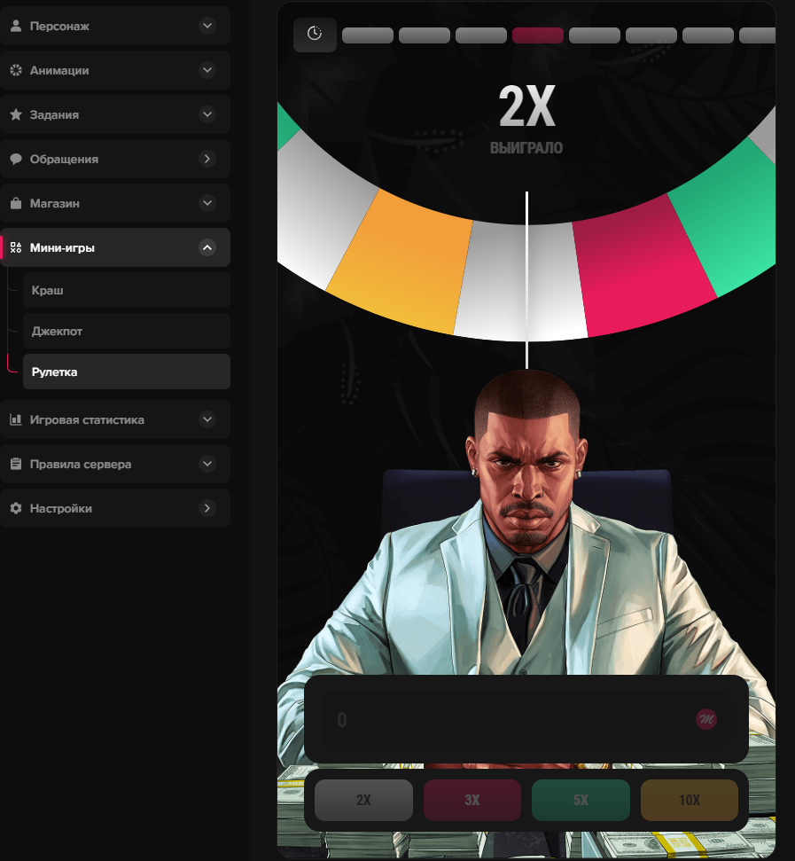

# 🎰 AI Roulette Learning System

[English](#english) | [Русский](#russian)

**Advanced Machine Learning System for Casino Roulette Pattern Recognition**

[Features](#features) • [Installation](#installation) • [Usage](#usage) • [Documentation](#documentation)

---

## 🇬 English Version

###  Overview

The **AI Roulette Learning System** is a sophisticated machine learning framework designed to analyze roulette game patterns using LSTM (Long Short-Term Memory) neural networks. This research project explores the application of deep learning techniques for pattern recognition in casino roulette games within the GTA 5 Majestic Roleplay environment.

### ✨ Features

- **🧠 LSTM Neural Network**: Advanced recurrent neural network architecture for sequence prediction
- **📊 Real-time Analysis**: Processes game history and predicts outcomes with confidence scores
- **💰 Smart Betting System**: Adaptive betting strategy with bankroll management
- **🔄 Pattern Recognition**: Identifies complex patterns in roulette outcomes (2X, 3X, 5X, 10X)
- **📈 Performance Tracking**: Comprehensive statistics and accuracy monitoring
- **💾 State Persistence**: Saves model state, training data, and betting history
- **🎯 Confidence-based Predictions**: Provides probability distributions for all outcomes
- **🛡️ Survival Mode**: Automated character needs management (hunger/thirst)

### 🏗️ Architecture
AI Roulette System
├── LSTM Neural Network (8-sequence input)
├── Embedding Layer (4 classes → 16 dimensions)
├── Pattern Recognition Engine
├── Betting Strategy Module
└── Survival Management System

### 📦 Installation

#### Prerequisites
Python 3.8+
PyTorch 1.9+
OpenCV
MSS (screen capture)
PyTesseract (OCR)

#### Quick Start
# Clone the repository
git clone https://github.com/MrKarpovich/gta5.git
cd gta5/majestic-roleplay/research/ai-learning/casino/roulette

# Install dependencies
pip install torch torchvision torchaudio
pip install opencv-python mss pytesseract pywin32 numpy

# Run the system
python ai_model.py

🚀 Usage
Initial Setup
python ai_model.py
# Select your working directory when prompted

Start Bot
Press F4 to start/stop the bot
The system will capture the game screen and analyze roulette patterns
Hotkeys
F4 - Start/Stop bot
1 + 2 - Save state and exit
1 + 3 - Change working directory

📁 Project Structure
roulette/
├── ai_model.py              # Main AI system
├── logs/                    # Training and prediction logs
│   ├── bot_YYYY-MM-DD.txt  # Daily operation logs
│   └── data_YYYY-MM-DD.csv # Structured data
├── models/                  # Saved model states
│   ├── ai_model.pt         # PyTorch model weights
│   └── state.pkl           # System state
└── README.md               # This file

### 🎯 How It Works
Screen Capture: System captures game screen every 0.5 seconds
OCR Processing: Extracts game ID and history using Tesseract
Color Detection: Analyzes roulette cell colors to determine multipliers
Pattern Learning: LSTM network learns from sequence patterns
Prediction: Generates probability distribution for next outcome
Betting Decision: Makes betting decisions based on confidence and strategy
State Management: Automatically saves progress and handles interruptions
### 📈 Performance Metrics
Accuracy Tracking: Real-time accuracy calculation
Confidence Scoring: Probability-based predictions
Bankroll Management: Virtual balance tracking
Win/Loss Statistics: Comprehensive performance analytics
### ⚙️ Configuration
Edit constants in ai_model.py:
Game coordinates (1600x900 resolution)
CELLS = [(411, 113, 42, 14), ...]  # Roulette history cells
ZONE_GAME_ID = (1060, 109, 80, 25)  # Game ID area
Betting strategy
BET_AMOUNTS = [10, 20, 40]  # Progressive betting levels
MAX_ATTEMPTS = 10  # Attempts per level
AI parameters
SEQ_LEN = 8  # Sequence length
HIDDEN_DIM = 32  # LSTM hidden dimension
LR = 0.001  # Learning rate
🔒 Safety Features
UI Validation: Checks if game interface is visible before acting
Error Handling: Graceful error recovery
State Persistence: Auto-save every prediction
Survival Priority: Character needs handled automatically
Bet Protection: Prevents duplicate bets per round
📝 Logging
The system creates detailed logs:
Console Output: Real-time predictions and accuracy
Text Logs: bot_YYYY-MM-DD.txt - Full operation history
CSV Data: data_YYYY-MM-DD.csv - Structured data for analysis
🧪 Research Notes
This is a research project exploring:
LSTM applications in game pattern recognition
Real-time computer vision for game analysis
Reinforcement learning for betting strategies
Sequence prediction in stochastic systems
⚠️ Disclaimer
This software is for educational and research purposes only. Use responsibly and at your own risk. The developers are not responsible for any losses incurred while using this system.

## 🇷🇺 Русская Версия
### 📋 Обзор
AI Roulette Learning System — это продвинутая система машинного обучения на базе LSTM (Long Short-Term Memory) нейронных сетей для анализа паттернов в рулетке. Исследовательский проект по применению глубокого обучения для распознавания закономерностей в казино рулетке на сервере GTA 5 Majestic Roleplay.
✨ Возможности
🧠 LSTM Нейросеть: Продвинутая рекуррентная архитектура для предсказания последовательностей
📊 Анализ в реальном времени: Обработка истории игры и предсказание результатов с оценкой уверенности
💰 Умная система ставок: Адаптивная стратегия с управлением банкроллом
🔄 Распознавание паттернов: Выявление сложных закономерностей (2X, 3X, 5X, 10X)
📈 Отслеживание производительности: Комплексная статистика и мониторинг точности
💾 Сохранение состояния: Сохранение модели, данных обучения и истории ставок
🎯 Предсказания на основе уверенности: Распределение вероятностей для всех исходов
🛡️ Режим выживания: Автоматическое управление потребностями персонажа
🏗️ Архитектура
AI Roulette System
├── LSTM Нейросеть (входная последовательность 8)
├── Слой Embedding (4 класса → 16 измерений)
├── Движок распознавания паттернов
├── Модуль стратегии ставок
└── Система управления выживанием

### 📦 Установка
Требования
Python 3.8+
PyTorch 1.9+
OpenCV
MSS (захват экрана)
PyTesseract (OCR)
Клонируйте репозиторий
git clone https://github.com/MrKarpovich/gta5.git
cd gta5/majestic-roleplay/research/ai-learning/casino/roulette
Установите зависимости
pip install torch torchvision torchaudio
pip install opencv-python mss pytesseract pywin32 numpy
Запустите систему
python ai_model.py

### 🚀 Использование
python ai_model.py
Выберите рабочую директорию когда будет запрошено

## Запуск бота
Нажмите F4 для запуска/остановки бота
Система будет захватывать экран игры и анализировать паттерны рулетки
Горячие клавиши
F4 - Старт/Стоп бота
1 + 2 - Сохранить состояние и выйти
1 + 3 - Изменить рабочую директорию

### 📁 Структура проекта
roulette/
├── ai_model.py              # Основная AI система
├── logs/                    # Логи обучения и предсказаний
│   ├── bot_YYYY-MM-DD.txt  # Ежедневные логи операций
│   └── data_YYYY-MM-DD.csv # Структурированные данные
├── models/                  # Сохраненные состояния модели
│   ├── ai_model.pt         # Веса модели PyTorch
│   └── state.pkl           # Состояние системы
└── README.md               # Этот файл

# 🎯 Как это работает
Захват экрана: Система захватывает экран игры каждые 0.5 секунды
OCR обработка: Извлекает ID игры и историю используя Tesseract
Определение цветов: Анализирует цвета ячеек рулетки для определения множителей
Обучение паттернам: LSTM сеть обучается на последовательностях паттернов
Предсказание: Генерирует распределение вероятностей для следующего исхода
Решение о ставке: Принимает решения о ставках на основе уверенности и стратегии
Управление состоянием: Автоматически сохраняет прогресс и обрабатывает прерывания
## 📈 Метрики производительности
Отслеживание точности: Расчет точности в реальном времени
Оценка уверенности: Предсказания на основе вероятностей
Управление банкроллом: Отслеживание виртуального баланса
Статистика побед/поражений: Комплексная аналитика производительности
### ⚙️ Конфигурация
Отредактируйте константы в ai_model.py:
#### Координаты игры (разрешение 1600x900)
CELLS = [(411, 113, 42, 14), ...]  # Ячейки истории рулетки
ZONE_GAME_ID = (1060, 109, 80, 25)  # Область ID игры
#### Стратегия ставок
BET_AMOUNTS = [10, 20, 40]  # Прогрессивные уровни ставок
MAX_ATTEMPTS = 10  # Попыток на уровень
#### Параметры AI
SEQ_LEN = 8  # Длина последовательности
HIDDEN_DIM = 32  # Скрытая размерность LSTM
LR = 0.001  # Скорость обучения

### 🔒 Функции безопасности
Валидация UI: Проверяет видимость интерфейса игры перед действием
Обработка ошибок: Корректное восстановление после ошибок
Сохранение состояния: Автосохранение каждого предсказания
Приоритет выживания: Потребности персонажа обрабатываются автоматически
Защита ставок: Предотвращает дублирование ставок за раунд
### 📝 Логирование
Система создает детальные логи:
Консольный вывод: Предсказания и точность в реальном времени
Текстовые логи: bot_YYYY-MM-DD.txt - Полная история операций
CSV данные: data_YYYY-MM-DD.csv - Структурированные данные для анализа
### 🧪 Исследовательские заметки
Это исследовательский проект, изучающий:
Применение LSTM в распознавании игровых паттернов
Компьютерное зрение реального времени для анализа игр
Обучение с подкреплением для стратегий ставок
Предсказание последовательностей в стохастических системах
# ⚠️ Отказ от ответственности
Это программное обеспечение предназначено только для образовательных и исследовательских целей. Используйте ответственно и на свой страх и риск. Разработчики не несут ответственности за любые убытки, понесенные при использовании этой системы.

  
Made with ❤️ for Research & Education
Report Issue • Request Feature • Discussions
© 2026 AI Roulette Learning System. MIT License.

